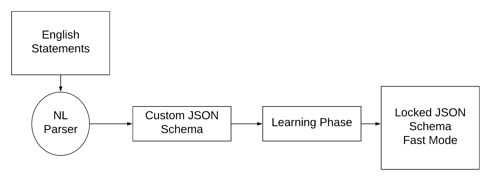
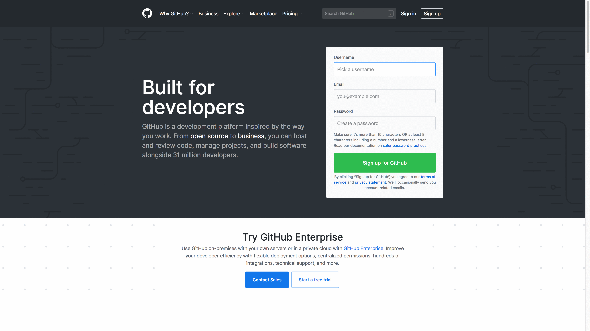

# automation-for-humans

 [](https://travis-ci.org/intuit/automation-for-humans) [](https://www.codacy.com/app/rohithr31/automation-for-humans?utm_source=github.com&amp;utm_medium=referral&amp;utm_content=intuit/automation-for-humans&amp;utm_campaign=Badge_Grade)

Converts english statements to Selenium Automation.

## Architecture



## Demo


## How to use
- See <a href="#integrating-with-any-environment">integrating-with-any-environment</a> to see how to install the dependencies.
- Install the parser. See the [DSL] repo for more details.
```bash
git submodule update --init
make -C dsl/ alpine
```
- Write English statements for some flow.
    - See [github navigation demo](./sample-inputs/public-sites/github-nav-demo.txt) for reference.
- Define a suite say `public-sites`.
Write the test cases to execute inside.
```json
{
    "name": "public-sites",
    "platform": "web",
    "executables": [
        {
            "name": "github",
            "type": "file",
            "location": "sample-inputs/public-sites/github-nav-demo.txt"
        }
    ]
}
```
- Add the suite to the [run.json](./suites/run.json)
```json
{
    "execution-mode": "parallel",
    "runnables": [
        "suites/public-sites.json"
    ]
}
```
- Run the code from the root directory :
```bash
python3 src/automate.py
```
- After the code is executed, one can see the screenshots and the gif in the `recordings/` folder created.

## English Keywords
<table>
    <tr>
        <th>Keyword</th>
        <th>Use</th>
        <th>Example</th>
    </tr>
    <tr>
        <td><a href="#english-keywords"><code>open</code></a></td>
        <td>Used to open a url/application</td>
        <td>
            <a href="#english-keywords"><code>open "https://github.com/"</code>
        </td>
    </tr>
    <tr>
        <td><a href="#english-keywords"><code>click</code></a></td>
        <td>Used to click on an element</td>
        <td>
            <a href="#english-keywords"><code>click on "Issues"</code>
        </td>
    </tr>
    <tr>
        <td><a href="#english-keywords"><code>type</code></a></td>
        <td>Used to type a string in some element</td>
        <td>
            <a href="#english-keywords"><code>type "afh-random-user" in "Pick a username"</code>
        </td>
    </tr>
    <tr>
        <td><a href="#english-keywords"><code>wait</code></a></td>
        <td>Wait's for a particular amount of time in seconds</td>
        <td>
            <a href="#english-keywords"><code>wait for "10"</code>
        </td>
    </tr>
    <tr>
        <td><a href="#english-keywords"><code>hover</code></a></td>
        <td>Used to hover over an element</td>
        <td>
            <a href="#english-keywords"><code>hover on "Fragments"</code>
        </td>
    </tr>
    <tr>
        <td><a href="#english-keywords"><code>execjs</code></a></td>
        <td>Used to execute javascript inside the browser context</td>
        <td>
            <a href="#english-keywords"><code>execjs "localStorage.setItem('random-key', 'false');"</code>
        </td>
    </tr>
</table>

That's all! We currently support only a minimum set of keywords and intend to keep to it that way. There are some advanced-searching that you can do with the same keywords, explained in <a href="#advanced-keywords-use">advanced-keywords-use</a>.

### Core Philosophy
The core philosophy of [automation-for-humans] is that the automation tests should mimic the user's behavior. Then we ask ourselves the question, what all things can a user do while they are interacting with the UI that we have built. The most common actions that a user does is <a href="#english-keywords"><code>click</code></a>, <a href="#english-keywords"><code>type</code></a>, <a href="#english-keywords"><code>hover</code></a>. More complex actions include <a href="#english-keywords"><code>drag-and-drop</code></a>, <a href="#english-keywords"><code>click-and-drag</code></a> etc. Supporting the complex actions would involve and non-trival pixel math which [automation-for-humans] does not plan to support in the initial phase.

Another aspect core to [automation-for-humans] is that it does not store [XPath]'s and use it as an identifier while running the tests. Instead [automation-for-humans] stores only the text, which is how the user sees and interacts with the page.

## Integrating with any environment
Integrating with [automation-for-humans] is extremely simple and involves just one step, <b>installing the dependencies</b>.

### OS support :

<div align="center">
    <table>
        <tr>
            <td>
                
            </td>
            <td>
                
            </td>
            <td>
                
            </td>
            <td>
                
            </td>
        </tr>
        <tr>
            <td>
                <a href="./src/install-dependencies/install-dependencies-win.bat">
                    install-dependencies-win.bat
                </a>
            </td>
            <td>
                <a href="./src/install-dependencies/install-dependencies-linux.sh">
                    install-dependencies-linux.sh
                </a>
            </td>
            <td>
                <a href="./src/install-dependencies/install-dependencies-mac.sh">
                    install-dependencies-mac.sh
                </a>
            </td>
            <td>
                <a href="https://github.com/automation-for-humans/docker-image">
                    automation-for-humans/docker-image
                </a>
            </td>
        </tr>
    </table>
</div>

### CI-Platforms
<table>
    <tr>
        <td>
            
        </td>
        <td>
            
        </td>
    </tr>
    <tr>
        <td>
            <a href="./.circleci/config.yml">
                .circleci/config.yml
            </a>
        </td>
        <td>
            <a href="./.travis.yml">
                .travis.yml
            </a>
        </td>
    </tr>
</table>

## Advanced Keywords Use
Sometimes one has no choice but to use the `id`'s, `class`, `automation-id` attributes to identify elements on the web-page. For such edge-cases and to provide completeness to the testing framework, [automation-for-humans] exposes an additional feature with most of keywords.

<table>
    <tr>
        <th>Keyword</th>
        <th>Use</th>
        <th>Example</th>
    </tr>
    <tr>
        <td><a href="#advanced-keywords-use"><code>click</code></a></td>
        <td>Used to click on an element with id "issues-id"</td>
        <td>
            <a href="#advanced-keywords-use"><code>click on "issues-id" "id"</code>
        </td>
    </tr>
    <tr>
        <td><a href="#advanced-keywords-use"><code>click if present</code></a></td>
        <td>Used to click on an element if its present</td>
        <td>
            <a href="#advanced-keywords-use"><code>click if present on "issues-id"</code>
        </td>
    </tr>
    <tr>
        <td><a href="#advanced-keywords-use"><code>type</code></a></td>
        <td>Used to type a string in some element with class name "#user-name"</td>
        <td>
            <a href="#advanced-keywords-use"><code>type "afh-random-user" in "#user-name" "class"</code>
        </td>
    </tr>
</table>

<b>One can search for an element with any attribute using the above syntax.</b>

### Resolving ambiguity
If multiple elements exists on the page that look alike(text-wise) then there is ambiguity by specifying the order in which they appear. Defaults to the 1st element that appears if nothing is specified.

<table>
    <tr>
        <th>Keyword</th>
        <th>Use</th>
        <th>Example</th>
    </tr>
    <tr>
        <td><a href="#resolving-ambiguity"><code>click</code></a></td>
        <td>Used to click on the 2nd issue</td>
        <td>
            <a href="#advanced-keywords-use"><code>click on 2nd "issue"</code>
        </td>
    </tr>
    <tr>
        <td><a href="#resolving-ambiguity"><code>type</code></a></td>
        <td>Used to type a string in the 4th text box named "enter text here"</td>
        <td>
            <a href="#resolving-ambiguity"><code>type "afh-random-user" in 4th "enter text here"</code>
        </td>
    </tr>
</table>

## Experimental Features

### Mac OS X UI Automation
[automation-for-humans] also works with automating Mac OS X apps. It uses [Appium For Mac] as the underlying driver.

Currently it supports interaction by specifying the AXPath's. This is completely against the <a href="#core-philosophy" />core-philosophy</a> that automation should be done in a way the user would interact with the UI rather than hidden details and xpath's. Support for using it without specifying AXPath's is being worked on.

New Keywords added :

<table>
    <tr>
        <th>Keyword</th>
        <th>Use</th>
        <th>Example</th>
    </tr>
    <tr>
        <td><a href="#mac-os-x-ui-automation"><code>wait until</code></a></td>
        <td>Used to wait until the element is visible</td>
        <td>
            <a href="#mac-os-x-ui-automation"><code>wait until "/AXApplication[@AXTitle='Calculator']"</code>
        </td>
    </tr>
</table>

#### Record and Replay functionality for Mac OS X apps
[automation-for-humans] provides a record and replay functionality for users to records the actions and replay them.
In fact the [sample-inputs/mac-osx-apps/calculator.txt](sample-inputs/mac-osx-apps/calculator.txt) has been generated using the same functionality.

To records, first start [Appium For Mac]. Then in the terminal execute :
```bash
python3 src/action-recorder-mac.py <app-name> <output-file-path>
```

Press `Ctrl + C` to terminalte the script from recording.

This will produce a file with all the commands that you have executed in a way that [automation-for-humans] understands. For readability,
the script also add in a comment before each line (starting with `#`) which attempts to be the english version of the same command.

[automation-for-humans]: https://github.com/intuit/automation-for-humans
[XPath]: https://en.wikipedia.org/wiki/XPath
[CircleCI]: https://circleci.com/
[Appium For Mac]: https://github.com/appium/appium-for-mac
[DSL]: https://github.com/automation-for-humans/dsl
